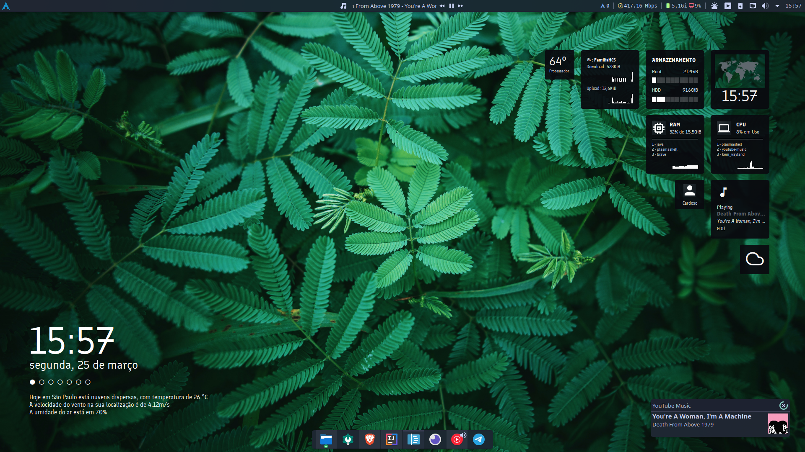
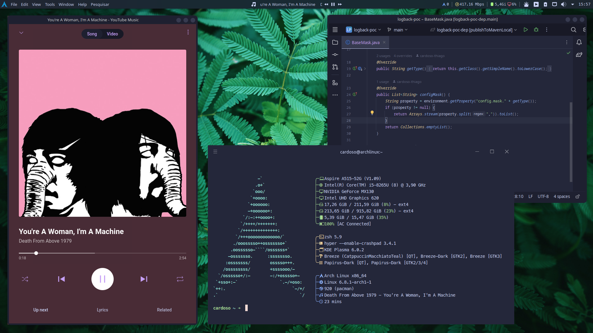

# Dotfiles

## Plasmoids adicionais utilizados

* [Shutdown or Switch](https://store.kde.org/p/1288430)
* [plasmusic-toolbar](https://store.kde.org/p/2128143)
* [Vector Clock Plasma6](https://store.kde.org/p/2137726)
* [Separator Line](https://store.kde.org/p/2136852)
* [Condensed Weather [Plasma 6]](https://store.kde.org/p/2137197)
* [Command Output](https://store.kde.org/p/2136636/)

### Comandos do plasmoid Command Output

* Velocidade Internet: `echo "  $(speedtest --no-upload --simple | awk 'NR==2{print$2" "$3}')"`
* Uso de memória: `free -h | awk '/Mem/{printf(" %s "), $3}'`
* Uso de CPU: `echo "  "$[100-$(vmstat 1 2|tail -1|awk '{print $15}')]"%"`